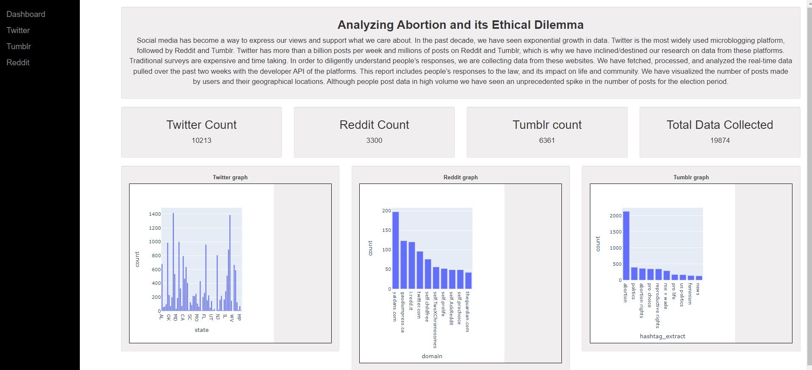
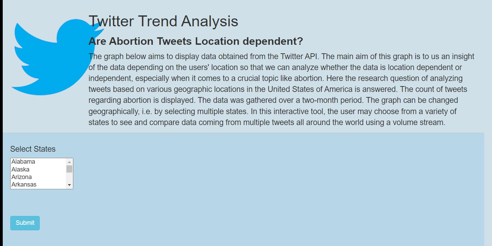
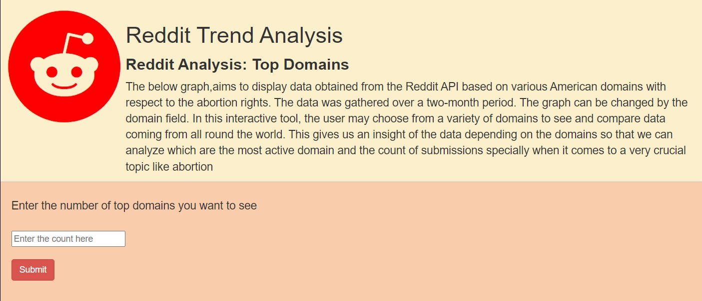
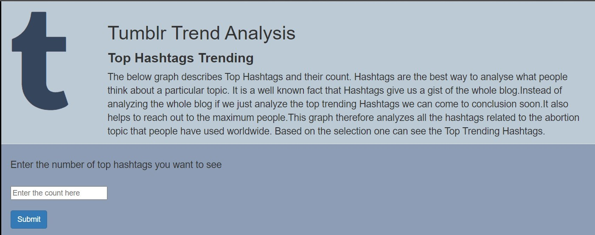

## Project Abstract
Social media has become a way to express our views and support what we care about. In the past decade, we have seen exponential growth in data. Twitter is the most widely used microblogging platform, followed by Reddit and Tumblr. Twitter has more than a billion posts per week and millions of posts on Reddit and Tumblr, which is why we have inclined/destined our research on data from these platforms. Traditional surveys are expensive and time taking. In order to diligently understand people’s responses, we are collecting data from these websites. We have fetched, processed, and analyzed the real-time data pulled over the past two weeks with the developer API of the platforms. This report includes people’s responses to the law and its impact on life and the community. We have visualized the number of user posts and their geographical locations. Although people post data in high volume we have seen an unprecedented spike in the number of posts for the election period.
On the dashboard, we can also see the real-time count of the Tweets, Reddit, and Tumblr blogs fetched directly from the database. In the navigation bar, upon selecting the specific webpage whether it is Twitter, Tumblr, or Reddit one can dynamically select the graph that one wants to generate, use features like zoom in and zoom out, hover over the graph to get the details of the graph and download if required.

## Team - Report-Fantastic_5

* Jigeesha Jain, jjain1@binghamton.edu
* Sumeet Patil, spatil38@binghamton.edu
* Supriya Patil, spatil33@binghamton.edu
* Shriya Khatri, skhatri3@binghamton.edu

## Tech-stack

* `python` - The project is developed and tested using python v3.8. [Python Website](https://www.python.org/)
* `request` - Request is a popular HTTP networking module(aka library) for python programming language. [Request Website](https://docs.python-requests.org/en/latest/#)
* `MongoDB` - No SQL Database to store data in the json format.[MongoDB Website] (https://www.mongodb.com/)
* `MongoDB Connection` - With help of official documentation we were able to achieve installation on VM and store data (https://www.mongodb.com/docs/manual/tutorial/install-mongodb-on-ubuntu/)
(https://wiki.crowncloud.net/?How_to_Install_Latest_MongoDB_on_Ubuntu_22_04)
* `Bootstrap` - Bootstrap is a free and open-source CSS framework directed at responsive, mobile-first front-end web development. It contains HTML, CSS and JavaScript-based design templates for typography, forms, buttons, navigation, and other interface components.
* `Flask` - Flask is a micro web framework written in Python. It is classified as a microframework because it does not require particular tools or libraries. It has no database abstraction layer, form validation, or any other components where pre-existing third-party libraries provide common functions.

## Analysis on three data source

With the collected data, we have done analysis and projected with graphs. 

* `Twitter`
 -  We did location based analysis for twitter, from all the collected posts we extracted the good locations mentioned and drew the conclusion of number of tweets for states in America related to abortion. 

* `Reddit`
  - We have filtered different domains posted in a blog and aggregated over the dataset and analysed the plot.
 
* `Tumblr` 
  -  Hashtags generally tend to give the most crucial information of post so we have aggregated hastags from the posts.

## How to run the project?

Install `Python` and `MongoDB`
Python Lib required-> urllib, requests, json, pandas, pymongo, time, flask, pusher, matplotlib, plotly, os, collections

pip install pandas, numpy, pymongo, schedule, requests

In order to find the program files go to VM and in that acess the jjain1/Project3 folder. It has mainly two folders viz. static, templates.
The data is fetched in real time for for all data source. We have used cron job to run the project 1 files for data collection.
This helps us to achieve visualization of real time data.
In order to execute the code follow the below steps:
1. Go to jjain1/Project3 folder
2. Command used to run the project: $python3 -m flask run
3. Application will load on [http://127.0.0.1:5000/dashboard](http://127.0.0.1:5000/dashboard). 
4. Dashboard has the three static graphs with 3 blogs displaying real time count of posts in tree datasets.

5. Other three pages have functionality to change parameter and fetch the paramterized graph based on selection.There are three seperate webpages for three different social media platforms. 
6. For eg: when the user wants to visualize the Twitter data he can select Twitter on the side Nav bar and then select multiple states pressing Ctrl+ mouse click. If the user wants to select all the states, he can press Ctrl and scroll till the end of the selection and release ctrl. It will select all states and graph will be populated automatically.

7. In case of Reddit and Tumblr the user needs to input the number of domains and hashtage count he wants to visualize respectively.

8. The dahboard as well as all the graphs provide multiple functionalities like zoom in, zoom out by pointing the mouse dragging spefic area and after that it will automatically zoom in. Reversely it will zoom out. 
9. The project also has the functionality of downloading the graphs in the local system in image format.
10. The user can get the details of that specific bar graph i.e. count just by hovering over it which makes the project and the graphs very insightful.
